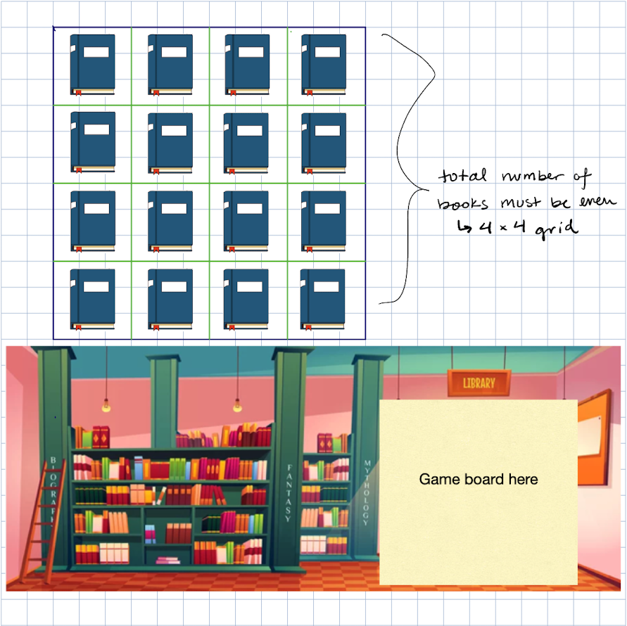

# Library Memory Game

# Premise
The library is a mess. You've been asked to help the librarian organize and put away all of the books that got pulled after a school group came through.  There are two copies of each book that need to be shelved together. 

# Game Play
The user will take turns turning flipping any two books. If you find two of the same books, they will remain showing. Once you pair all of the books, the librarian will take them and you win! 

However, every time you flip over a mis-matched pair, your cell phone will go off. The library has a strict noise volume policy. If your phone goes off ten times, you will be asked to leave the library, so choose carefully!

# Technologies Used
• HTML5

• CSS

• JavaScript

# Wireframes

Layout of game page.

# Future ideas:
• Add an instructions section to the welcome page that explains the game. 

• In the future I'd like to adapt this for mobile phones and make an app for it

